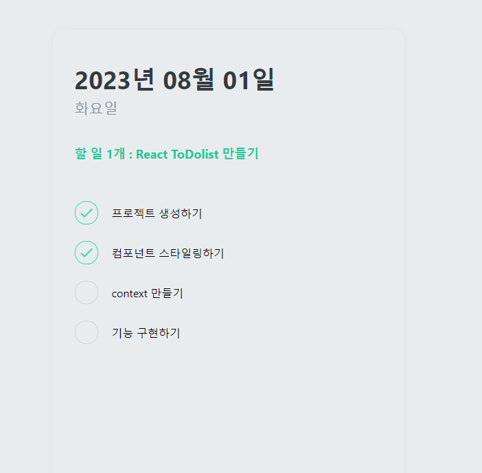

# 리액트 기초

## 걸음마 떼기

### 기초 투두리스트 구축

> 아직 부족한 부분 props / ${open}/ &&

### props 기본 사용법

예를 들어서, App 컴포넌트에서 Hello 컴포넌트를 사용 할 때 name 이라는 값을 전달해주고 싶다고 가정해봅시다. 그러면, 이렇게 코드를 작성하면 됩니다.

```javaScript
import React from 'react';
import Hello from './Hello';

function App() {
  return (
    <Hello name="react" />
  );
}

export default App;
```

이제, Hello 컴포넌트에서 name 값을 사용 하고 싶을 땐 어떻게 하면 되는지 알아볼까요?

```javaScript
import React from 'react';

function Hello(props) {
  return <div>안녕하세요 {props.name}</div>
}

export default Hello;
```

컴포넌트에게 전달되는 props 는 파라미터를 통하여 조회 할 수 있습니다. props 는 객체 형태로 전달되며, 만약 name 값을 조회하고 싶다면 props.name 을 조회하면 됩니다.

---

8월 1일 todolist 완성본


---

## 2차완성


기본적인 코드 구현 내용

```javaScript
 const [toDo,setTodo] = useState("");
 // 빈 공간이 있는 useState 생성

const onChange = (e) => {
  setTodo(e.target.value)
  console.log(toDo)
  }
// 해당 내용의 타겟 벨류가 체크가 되는지 안되는지 확인해보기 위한 값


```

```html
<form>
  <input type="text" placeholder="입력하세요" onChange="{onChange}" />
  <button>등록하기</button>
</form>
```

onChange 함수를 input 타입에 적용시켜준다
그렇다면 input에서 값을 입력 할 때마다 e.target.value로 인해 체크가 된다

또한 value 값으로 = {toDo}를 넣어줘야 usestate를 통해 시시때때로 입력 받는 값을 확인할 수 있다

```html
<form onSubmit="{onSubmit}">
  <input type="text" placeholder="입력하세요" onChange="{onChange}" value="{toDo}" />
  <button>등록하기</button>
</form>
```

value ={toDo}

```javaScript
const onSubmit = (e) => {
      e.preventDefault();
      if(toDo === ""){
          return
      }
      console.log(toDo)
      setTodo("")
  }
```

onSubmit 함수를 생성하여 e.preventDefault 함수를 부여 하여 폼이 제출될 때 나타나는 새로고침 값을 제어해줍니다.

마지막으로 입력된 toDo 값을 저장시켜줄 toDos라는 state를 추가로 만들어줍니다

```javaScript
  const [toDos,setTodos] = useState([]);
```

```javaScript
const onSubmit = (e) => {
        e.preventDefault();
        if(toDo === ""){
            return
        }
        setTodos((currentArray) =>[toDo, ...currentArray])
        setTodo("")
    }
console.log(toDos)
```

currentArray라는 임의의 변수 값을 만들어 toDo 안에서 입력되어지는 값을 스프레드 함수를 이용하여 합쳐준다

그렇게 되면 배열이 새로 추가되는 것을 볼 수 있는데

결과적으로 첫 줄에 있는 결과 값을 볼 수 있다.
